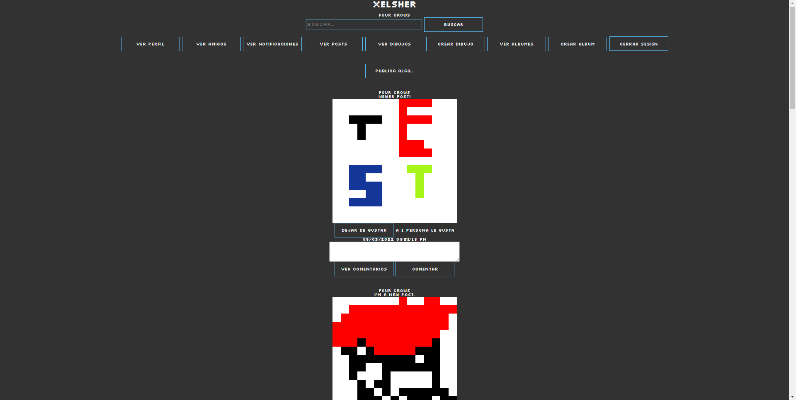
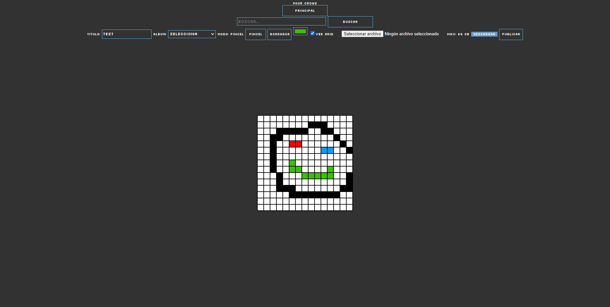

# Xelsher

Used: PHP, MySQL, JavaScript, HTML5, CSS.

A small social network web application that I made as a project in college. There's some aspects that are improvable, but at the moment I was very happy and proud with the result.  
The concept is that anyone can make small pixelarts and share them with the world. It's like a really small DeviantArt inspired social network.  
Unfortunately the project is only available in spanish.

## Instructions
1. Import the db_xelsher.sql file in your phpMyAdmin.
2. Put the rest of the project in a folder on your htdocs folder (or your php projects server folder).
3. On XAMPP turn on the Apache and MySQL services.
4. Open in your prefered browser localhost/yourprojectfolder/

Enjoy!

## Features
- View other profiles.
- Add other users as friends.
- Like posts functionality.
- Comment posts.
- Pixel art maker.
- Album functionality.
- Upload and use your own profile picture.
- Search bar functionality.
- Notifications for each user.

## Screenshots

